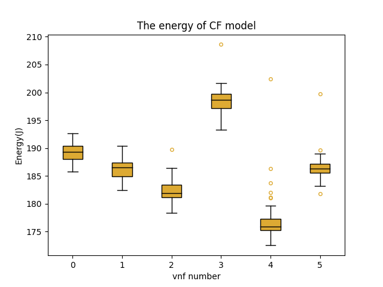
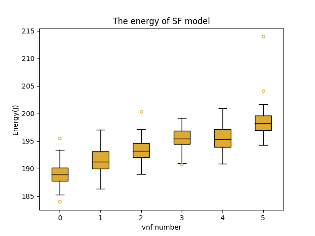

# Engegy of In-Network-Computing

## Description

This part attempts to observe the energy consumption of the pICA model , it is **based on the [comnetsemu](https://git.comnets.net/public-repo/comnetsemu)** and **[pICA-emu](https://github.com/Huanzhuo/pICA-emu)** .

## Requirements

1. Raspberry Pi with Ubuntu 20.04.3 LTS

2. Arduino UNO R3

3. Adafruit INA219

## Getting Started

### Part1. install the pICA on Raspberry Pi

1. Install the comnetsemu and simpleemu on the Raspberry Pi.

    ```bash
    cd ~/pICA-emu/emu-installer     
    bash ./install.sh
    ```

2. Install the docker image for pICA.

    ```bash
    cd ~/pICA-emu 
    sudo bash ./build_docker_images.sh
    ```

    Tips: This step can take a long time, The already built docker is placed in the **[link](https://drive.google.com/file/d/1ycI2l0fxlhCGN0kpHqCzdSGTeSjf8nbt/view?usp=sharing)**, you can also just load this docker to your device.


3. Run the topology in the folder ```~/pICA-emu/emulator```.

     For an arbitary number of VNFs, please define the value of n_vnf in topo_n_vnf.py and run topo_n_vnf.py instead of topo.py. With 3 VNFs for example:

    ```bash
    sudo python3 topo_n_vnf.py 3
    ```

    Please firstly run `server.py` inside the server's shell, then the rest. The default work mode is ```compute-and-forward``` (```cf```). With the flag ``` sf``` on the client, the work mode will be changed to ```store-and-forward```. With the flag ```data_id``` on the client, an integer value is expected to set the id of test data set. With the flag ```n_test``` on the client, an integer value is expected to set the evaluation rounds.

    ```bash
    # in the server terminal
    sudo python3 ./server.py

    # in the vnf terminal
    sudo python3 ./vnf.py

    # in the client terminal
    sudo python3 ./client.py cf data_id n_test

    ```

Tips: If the pICA dones't work on the Raspberry Pi, try to add the swap space with the command.

```bash
sudo bash Add_swap_space.sh
```

### Part2. Setting the Arduino and INA219 Chips

The  **[website of Adafruit](https://learn.adafruit.com/adafruit-ina219-current-sensor-breakout)**  gives detailed steps about how to conected the chips and so on. The code of ``` getcurrent.ino ``` is modified and put in the main folder, so that we can just get the data we need.

### Part3. Measure the power of the Raspberry

If we run pICA on the Raspberry Pi, we can get file named ``` time_vnf_number.csv ``` in the folder. And in the same time we run ``` read_power.py ``` on PC, we can also get a file named ``` VNF_number ```. When the measure finished, we should put this two file in a same folder and run ``` energy.py ``` in the folder. Then we can get the power and energy of the Raspberry Pi. And with ```plot.py``` we can get the boxplot of the energy result.

Tips: Make sure that the csv file has just 2 columns and m rows and every element is not lacked.

## Result

The Result is under the folder Result. Every work mode measure for 80 times. And plot the energy with box plot.



